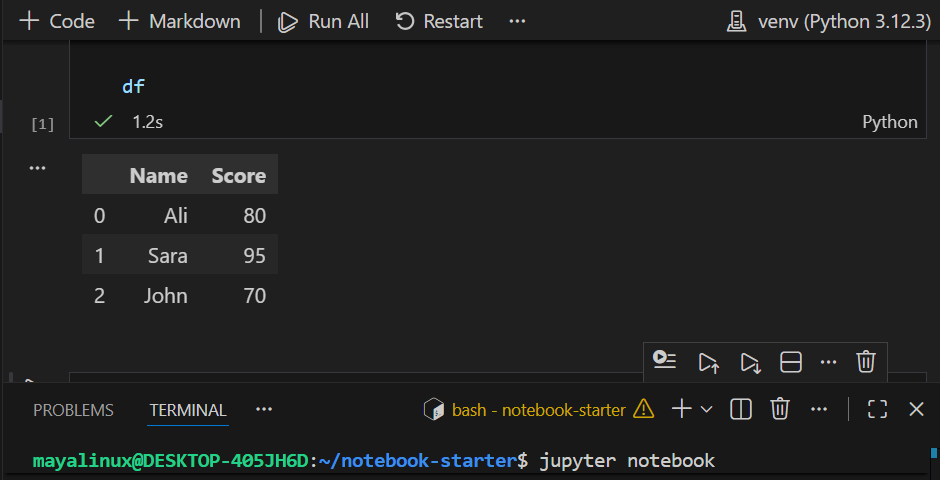
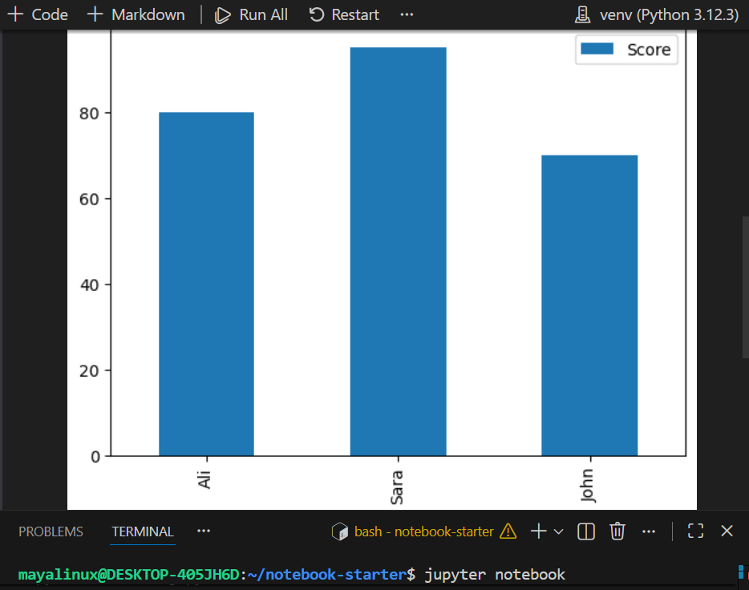

# Jupyter-Notebook-Starter-Project

## Overview

This project demonstrates basic data analysis using Jupyter Notebook, Pandas, and Matplotlib.

## Technologies

- Python 3.12
- Jupyter Notebook
- Pandas
- Matplotlib

## Features

- Creates a DataFrame
- Displays tabular data
- Generates a bar chart

## Screenshot

### DataFrame Output



### Chart Output



## How to Run

```bash
python3 -m venv venv
source venv/bin/activate
pip install pandas matplotlib notebook

jupyter notebook